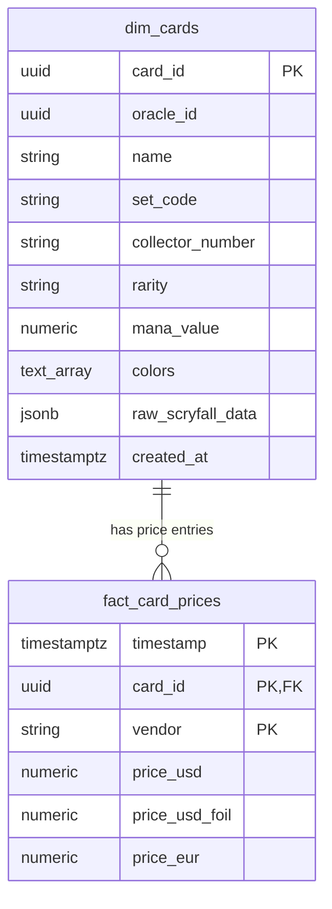

# Database Schema Documentation

> **Introspection Source:** `Offline Parsing (init.sql)`  
> **Last Generated:** `2026-09-13 20:10:59 UTC`

## Overview

The **Mana Market Engine** database is hosted on **TimescaleDB (PostgreSQL 16)**. It employs a hybrid SQL / JSONB data model separating static card metadata from time-series market pricing.

---

## Tables & Hypertables

### `dim_cards`

Dimension table storing static catalog metadata for Magic cards.

#### Columns

| Column | Type | Nullable | Primary Key | References | Default |
| :--- | :--- | :---: | :---: | :--- | :--- |
| **card_id** | `uuid` | NO | ✅ PK | - | - |
| **oracle_id** | `uuid` | YES |  | - | - |
| **name** | `text` | NO |  | - | - |
| **set_code** | `varchar(10)` | NO |  | - | - |
| **collector_number** | `text` | NO |  | - | - |
| **rarity** | `text` | NO |  | - | - |
| **mana_value** | `numeric` | YES |  | - | - |
| **colors** | `text[]` | YES |  | - | - |
| **raw_scryfall_data** | `jsonb` | NO |  | - | - |
| **created_at** | `timestamptz` | YES |  | - | `NOW()` |

#### Indexes

| Index Name | Definition |
| :--- | :--- |
| `dim_cards_pkey` | `CREATE UNIQUE INDEX dim_cards_pkey ON dim_cards (card_id)` |
| `idx_dim_cards_name` | `CREATE INDEX idx_dim_cards_name ON dim_cards (name)` |
| `idx_dim_cards_set` | `CREATE INDEX idx_dim_cards_set ON dim_cards (set_code)` |

---

### `fact_card_prices` *(TimescaleDB Hypertable)*

TimescaleDB Hypertable storing time-series financial prices across vendors.

> [!NOTE]
> **Partition Dimension:** `timestamp`  
> **Time Chunk Interval:** `Default 7-day chunk`  
> **Chunks:** `N/A (Offline mode)` | **Compression:** `False`

#### Columns

| Column | Type | Nullable | Primary Key | References | Default |
| :--- | :--- | :---: | :---: | :--- | :--- |
| **timestamp** | `timestamptz` | NO | ✅ PK | - | - |
| **card_id** | `uuid` | NO | ✅ PK | `dim_cards(card_id)` | - |
| **vendor** | `text` | NO | ✅ PK | - | - |
| **price_usd** | `numeric` | YES |  | - | - |
| **price_usd_foil** | `numeric` | YES |  | - | - |
| **price_eur** | `numeric` | YES |  | - | - |

#### Indexes

| Index Name | Definition |
| :--- | :--- |
| `fact_card_prices_pkey` | `CREATE UNIQUE INDEX fact_card_prices_pkey ON fact_card_prices (timestamp, card_id, vendor)` |
| `idx_fact_prices_card_time` | `CREATE INDEX idx_fact_prices_card_time ON fact_card_prices (card_id, timestamp DESC)` |

---
